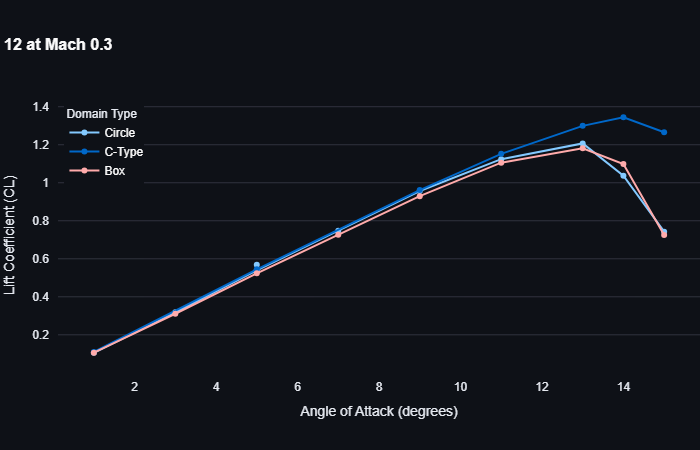
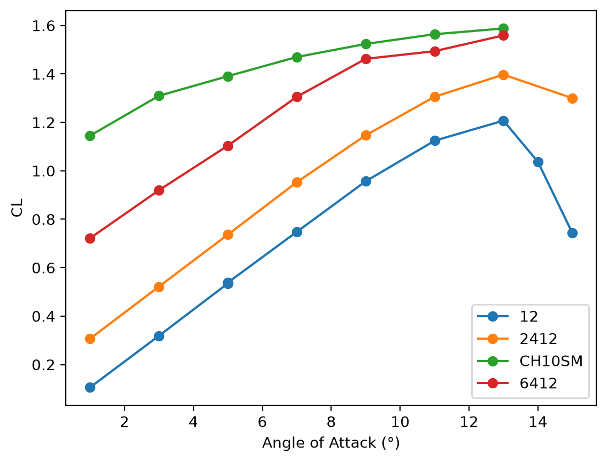
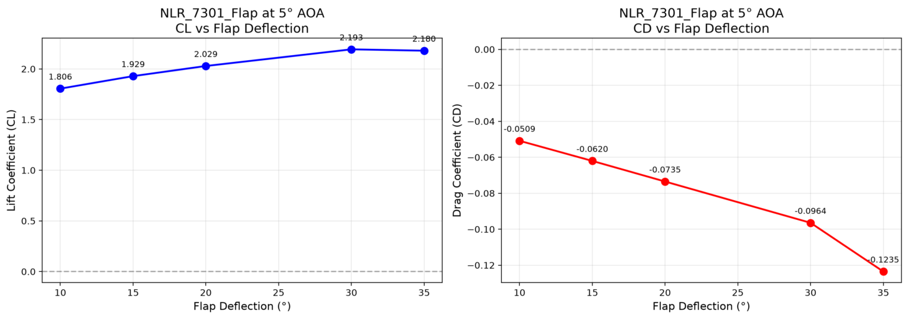
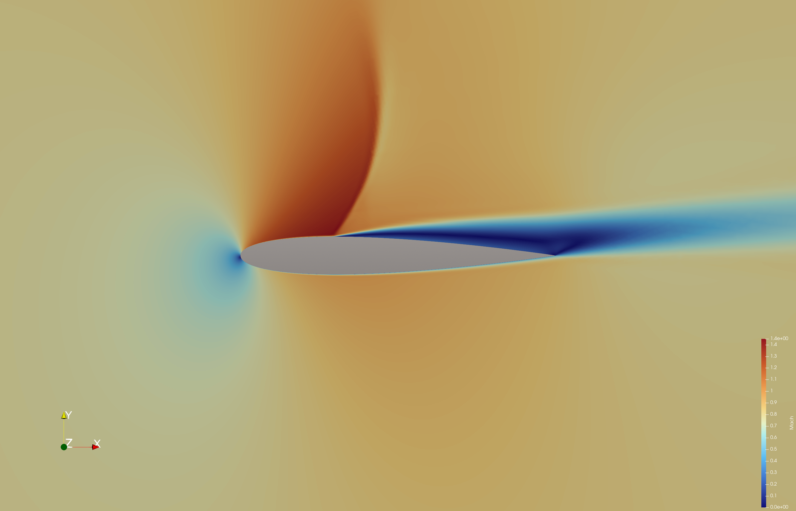

# Streamlit-SU2-Flow: Interactive Aerodynamic Simulation

An interactive, parameter-driven graphical user interface for 2D aerodynamic simulations, built with **Streamlit** and powered by **SU2** and **gmshairfoil2d**. 

This project eliminates the need to manually write and edit complex SU2 configuration (`.cfg`) files. Instead, users can define geometry, physics, and boundary conditions through an intuitive web UI, and the application dynamically generates the mesh and config files on the fly.

 Part of Streamlit UI showing quick view of simulation results
 Flap deflection 15 and AOA 5<!-- Add your mesh image here -->

## 🌟 Key Features

* **Zero-Config Workflow:** No more manual editing of `.cfg` files. Streamlit dynamically generates the SU2 configuration based on your UI selections.
* **Versatile Geometry Generation:** 
  * Basic shapes (Circle, Box)
  * C-Type meshes for single airfoils
  * **Multi-Element Airfoils:** Fully supported flap configurations (Main airfoil + trailing edge flap).
* **Automated Meshing:** Integrates seamlessly with `gmshairfoil2d` to generate high-quality SU2 meshes.
* **Comprehensive Physics:** Supports inviscid (Euler) and viscous (RANS/Navier-Stokes) simulations.
* **Instant Visualization:** Built-in plotting for aerodynamic coefficients ($C_L$, $C_D$, $C_M$) vs. Angle of Attack (AOA).

## 🛠️ Tech Stack & Build Details

* **Frontend / Orchestrator:** Python & Streamlit
* **Meshing:** `gmshairfoil2d`
* **Solver:** [SU2 (The Open-Source Suite for Multiphysics)](https://su2code.github.io/)
* **Post-Processing:** ParaView

### A Note on the SU2 Build (Windows 11)
For much of the development and testing, the **pre-compiled Windows binaries** of SU2 were used. However, a custom version of SU2 was also compiled from source on Windows 11. To streamline the build process and reduce dependencies, this custom build **omits CGNS support and native SU2 plotting functions**. Instead, all flow field visualization and post-processing is handled externally using **ParaView**, which is the industry standard and provides far superior rendering capabilities for complex meshes.

## 📊 Results & Validation

The application has been thoroughly tested and validated against standard aerodynamic benchmarks. The repository includes generated data and plots demonstrating the solver's accuracy across different configurations.

### 1. Mesh Independence Study (NACA 0012)
Comparison of $C_L$ vs AOA for a NACA 0012 airfoil using three different farfield mesh topologies:
* **Circle Mesh**
* **Box Mesh**
* **C-Type Mesh**

 Comparison Using Different Mesh Types

### 2. Airfoil Profile Comparison
Comparison of $C_L$ vs AOA demonstrating the effect of camber and thickness across different NACA 4-digit profiles:
* **NACA 0012** (Symmetric)
* **NACA 2412** (Cambered)
* **NACA 6412** (Highly Cambered)

 Comparison Using Different Airfoil Profiles

### 3. Multi-Element Flap Simulation
Successfully simulated a high-lift configuration using the NLR 7301 main airfoil with a trailing edge flap. 
* **Setup:** 5° AOA, 15° Flap Deflection.
* **Result:** Massive increase in lift coefficient ($C_L \approx 1.9$), demonstrating the tool's capability to handle complex, multi-body geometries and distinct boundary markers.
* The CL figures obtained by the simulation are reliable but the CD figures should be treated with caution.
 CL and CD for Different Deflections 
 
### 4. Testing using the SA Solver for Boundary Layer
Mostly the CFD tests were performed using the Spalart–Allmaras turbulence model
* This is well demonstrated below showing the shock wave produced at Mach 0.8 for NACA0012

 Shock Wave at Mach 0.8

### 5. FAQ section 
Incorporated as a Streamlit page which beginners may find useful when working with SU2 for the first time

## 6. Detailed Mesh Characteristics
🔵 Circle Farfield (Unstructured)
Geometry: Circular outer boundary with triangular elements throughout.
✅ Use When:
Running inviscid (Euler) simulations
Quick parametric studies or design space exploration
Testing new airfoil geometries
Memory is limited (smaller mesh size)
❌ Avoid When:
Running viscous (RANS) simulations requiring high accuracy
Simulating multi-element configurations with large gaps
Boundary layer resolution is critical
Performance:
⚡ Speed: Fast mesh generation, moderate solve time
💾 Memory: Low (~10-20k elements for typical 2D airfoil)
📉 Convergence: Moderate (residuals drop steadily but slowly)
Typical Settings:

Farfield Radius: 10-20 chords
Elements: ~15,000 triangles
Run Time: 2-5 minutes (inviscid), 10-15 minutes (viscous)

🟦 Box Farfield (Unstructured)
Geometry: Rectangular outer boundary with triangular elements.
✅ Use When:
Multi-element flap configurations (DEFLECTED FLAPS)
Complex geometries with multiple bodies
General-purpose viscous simulations
You need robust convergence across varied geometries
❌ Avoid When:
You need the fastest possible solution time
Running large parametric sweeps (use Circle instead)
Farfield boundary effects are critical (Circle is more isotropic)
Performance:
⚡ Speed: Moderate mesh generation, moderate-slow solve time
💾 Memory: Moderate (~20-40k elements for typical flap config)
📉 Convergence: Good (handles complex topologies well)
Typical Settings:
Farfield Distance: 10-30 chords
Elements: ~30,000 triangles (single airfoil), ~70,000 (flap)
Run Time: 5-10 minutes (single), 15-30 minutes (flap)

🏆 Recommended for: All multi-element flap simulations with deflection angles > 0°

🟢 C-Type Structured Grid
Geometry: Structured quadrilateral grid wrapping around the airfoil in a "C" pattern.
✅ Use When:
Single airfoil simulations (gold standard)
Viscous (RANS) simulations requiring high accuracy
Boundary layer resolution is critical (y+ < 1)
You need the fastest convergence and lowest run times
Validating against experimental data
❌ Avoid When:
Multi-element configurations with flap deflection (NOT SUPPORTED)
Complex geometries with multiple bodies
You need rapid mesh generation for many configurations
Performance:
⚡ Speed: Slower mesh generation, fastest solve time
💾 Memory: Moderate (~20-30k structured quads)
📉 Convergence: Excellent (aligned grid reduces numerical diffusion)
Typical Settings:
Farfield Distance: 15-25 chords
Boundary Layers: 35-50 layers
First Layer Height: 3e-5 to 1e-6 m (for y+ ≈ 1)
Growth Ratio: 1.15-1.25
Elements: ~25,000 quads
Run Time: 3-8 minutes (viscous, single airfoil)

** Recommended for:** All single airfoil viscous simulations, validation studies, and production runs
⚠️ Critical Limitation:
Structured meshes do not support deflected flaps. If you specify a flap deflection angle with a structured mesh, gmshairfoil2d will silently default to 0° deflection. Always use Circle or Box meshes for multi-element configurations.


## ⚠️ Known Issues

* **Hybrid Meshes:** Running SU2 with hybrid meshes (mixed element types) currently presents challenges. Specifically, mapping the boundary markers correctly for SU2 in a hybrid topology has proven problematic. Currently, the tool defaults to structured/unstructured quad-dominant or tri-dominant meshes to ensure marker stability.
* **Drag Coefficient for Flaps:** The SU2 solver creates negative drag for deflections which is physically impossible. The root cause is believed to be due to the poor quality triangular meshing at the hinge gap which increases as the deflection angle increases.   

## 🚀 Coming Soon

* **Moving Flaps:** Implementation of sliding meshes and deforming mesh capabilities to simulate dynamic flap deflection, pitching, and plunging airfoils.
* **Hybrid Mesh Support:** Ongoing research into resolving the marker mapping issues for hybrid meshes in SU2.

## 🏃 Usage

1. Clone the repository.
2. Install the required Python dependencies:
   ```bash
   pip install -r requirements.txt
