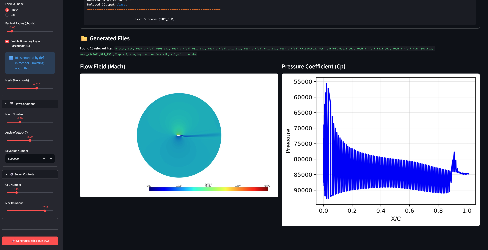
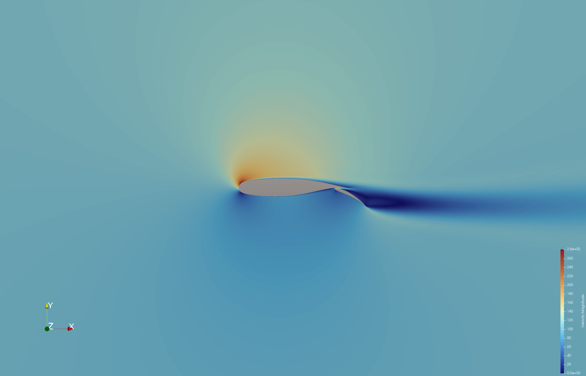
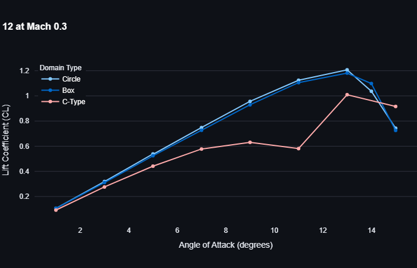

# Streamlit-SU2-Flow: Interactive Aerodynamic Simulation

An interactive, parameter-driven graphical user interface for 2D aerodynamic simulations, built with **Streamlit** and powered by **SU2** and **gmshairfoil2d**. 

This project eliminates the need to manually write and edit complex SU2 configuration (`.cfg`) files. Instead, users can define geometry, physics, and boundary conditions through an intuitive web UI, and the application dynamically generates the mesh and config files on the fly.

 Part of Streamlit UI showing quick view of simulation results
 Flap deflection 15 and AOA 5<!-- Add your mesh image here -->

## 🌟 Key Features

* **Zero-Config Workflow:** No more manual editing of `.cfg` files. Streamlit dynamically generates the SU2 configuration based on your UI selections.
* **Versatile Geometry Generation:** 
  * Basic shapes (Circle, Box)
  * C-Type meshes for single airfoils
  * **Multi-Element Airfoils:** Fully supported flap configurations (Main airfoil + trailing edge flap).
* **Automated Meshing:** Integrates seamlessly with `gmshairfoil2d` to generate high-quality SU2 meshes.
* **Comprehensive Physics:** Supports inviscid (Euler) and viscous (RANS/Navier-Stokes) simulations.
* **Instant Visualization:** Built-in plotting for aerodynamic coefficients ($C_L$, $C_D$, $C_M$) vs. Angle of Attack (AOA).

## 🛠️ Tech Stack & Build Details

* **Frontend / Orchestrator:** Python & Streamlit
* **Meshing:** `gmshairfoil2d`
* **Solver:** [SU2 (The Open-Source Suite for Multiphysics)](https://su2code.github.io/)
* **Post-Processing:** ParaView

### A Note on the SU2 Build (Windows 11)
For much of the development and testing, the **pre-compiled Windows binaries** of SU2 were used. However, a custom version of SU2 was also compiled from source on Windows 11. To streamline the build process and reduce dependencies, this custom build **omits CGNS support and native SU2 plotting functions**. Instead, all flow field visualization and post-processing is handled externally using **ParaView**, which is the industry standard and provides far superior rendering capabilities for complex meshes.

## 📊 Results & Validation

The application has been thoroughly tested and validated against standard aerodynamic benchmarks. The repository includes generated data and plots demonstrating the solver's accuracy across different configurations.

### 1. Mesh Independence Study (NACA 0012)
Comparison of $C_L$ vs AOA for a NACA 0012 airfoil using three different farfield mesh topologies:
* **Circle Mesh**
* **Box Mesh**
* **C-Type Mesh**

 Comparison Using Different Mesh Types

### 2. Airfoil Profile Comparison
Comparison of $C_L$ vs AOA demonstrating the effect of camber and thickness across different NACA 4-digit profiles:
* **NACA 0012** (Symmetric)
* **NACA 2412** (Cambered)
* **NACA 6412** (Highly Cambered)

*(Insert your CL vs AOA airfoil comparison plot here)*

### 3. Multi-Element Flap Simulation
Successfully simulated a high-lift configuration using the NLR 7301 main airfoil with a trailing edge flap. 
* **Setup:** 5° AOA, 15° Flap Deflection.
* **Result:** Massive increase in lift coefficient ($C_L \approx 1.9$), demonstrating the tool's capability to handle complex, multi-body geometries and distinct boundary markers.

## ⚠️ Known Issues

* **Hybrid Meshes:** Running SU2 with hybrid meshes (mixed element types) currently presents challenges. Specifically, mapping the boundary markers correctly for SU2 in a hybrid topology has proven problematic. Currently, the tool defaults to structured/unstructured quad-dominant or tri-dominant meshes to ensure marker stability.

## 🚀 Coming Soon

* **Moving Flaps:** Implementation of sliding meshes and deforming mesh capabilities to simulate dynamic flap deflection, pitching, and plunging airfoils.
* **Hybrid Mesh Support:** Ongoing research into resolving the marker mapping issues for hybrid meshes in SU2.

## 🏃 Usage

1. Clone the repository.
2. Install the required Python dependencies:
   ```bash
   pip install -r requirements.txt
